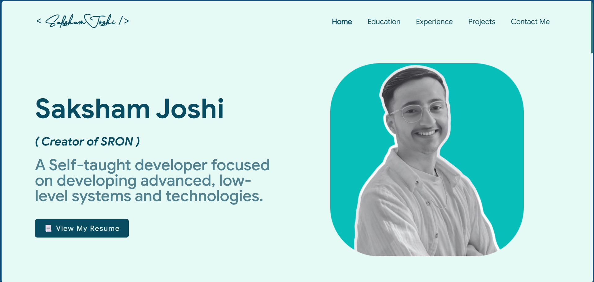
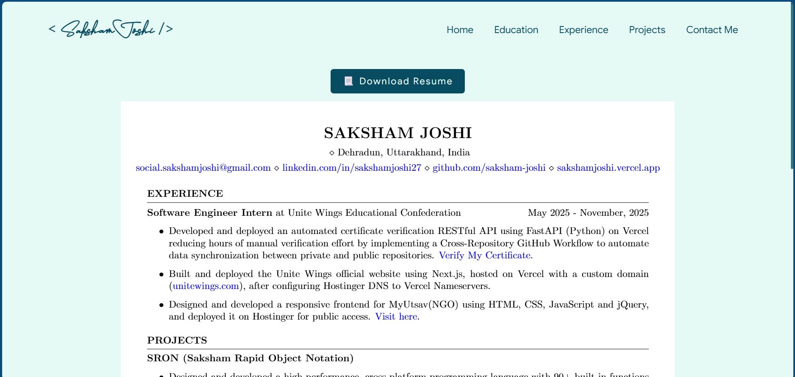
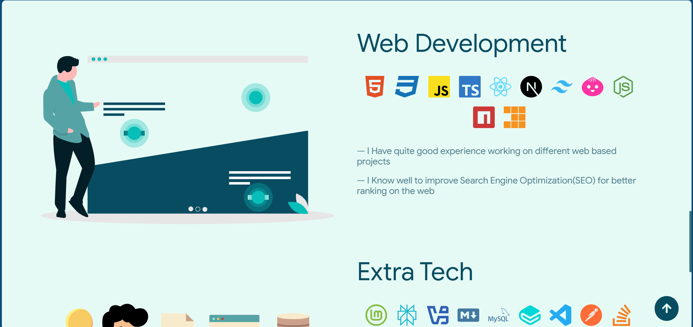
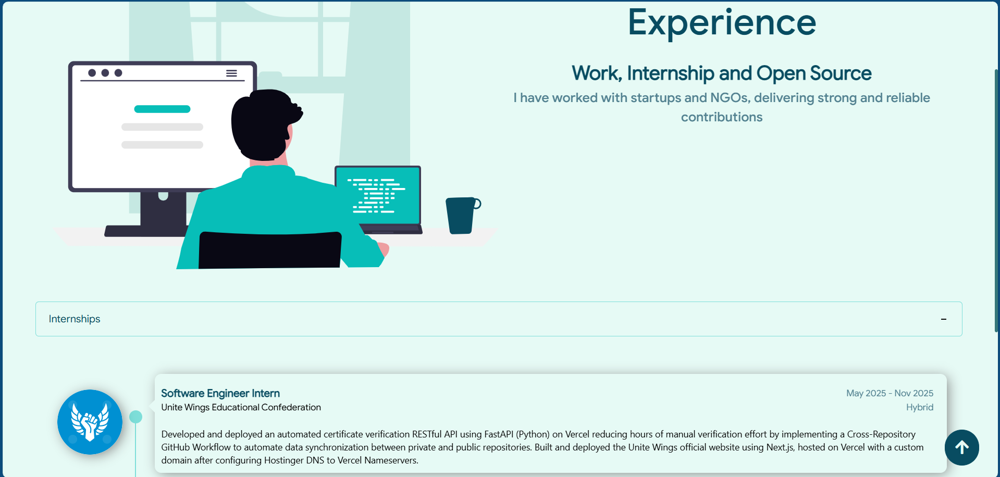
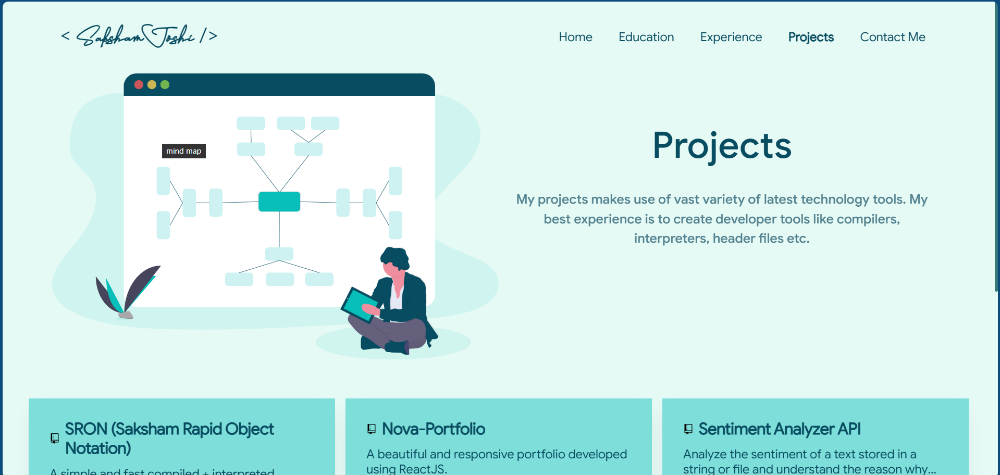
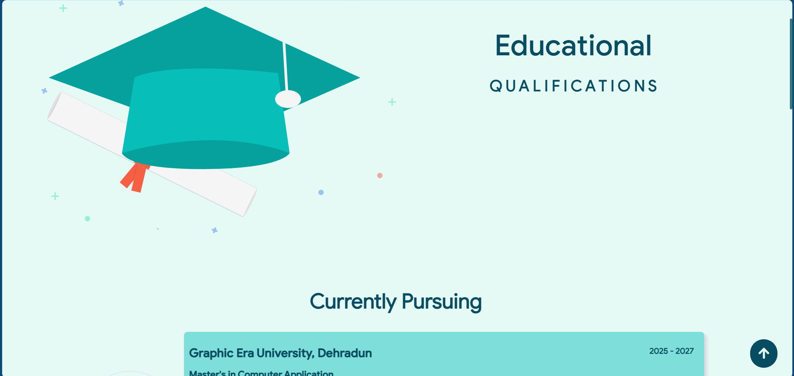

<div align="center">

# 🔥 Nova Portfolio

### A clean, beautiful & responsive portfolio for Software Developers

[](https://github.com/saksham-joshi/NovaPortfolio)
[](https://sakshamjoshi.vercel.app/)
<div align="center">
   
</div>

[View Demo](https://sakshamjoshi.vercel.app/) · [Report Bug](https://github.com/saksham-joshi/NovaPortfolio/issues) · [Request Feature](https://github.com/saksham-joshi/NovaPortfolio/issues)

</div>

---

<div align="center">
   
   
   
   
   
   
</div>

---

## ✨ Features

This portfolio template includes the following sections:

- **📝 Summary** - Brief introduction about yourself
- **💻 Skills** - Showcase your technical skills
- **💼 Experience** - Display your work experience
- **🎓 Education** - Highlight your educational background
- **🖼️ Gallery** - Display some good moments of your life.
- **🚀 Projects** - Feature your best projects
- **📬 Contact** - Easy ways to get in touch
- **📄 Resume** - Downloadable resume section

---

## 🚀 Getting Started

### Prerequisites

Make sure you have [Node.js](https://nodejs.org/) installed on your machine.

### Installation

1. **Fork or Clone the repository**

   ```bash
   git clone https://github.com/saksham-joshi/NovaPortfolio.git
   cd NovaPortfolio
   ```

2. **Install dependencies**

   ```bash
   npm install
   or
   pnpm install
   ```

3. **Start the development server**

   ```bash
   npm start
   or
   pnpm start
   ```

4. **Customize your portfolio**

   Edit the `src/portfolio.js` file to add your personal information, projects, skills, and experience.

5. **Deploy**

   Deploy your portfolio on platforms like Vercel, GitHub Pages, Netlify, or your preferred hosting service.

---

## 🎨 Customization

All portfolio content can be customized by editing the `src/portfolio.js` file. This file contains structured data for all sections including personal information, skills, projects, experience, and more.

---

## 🙏 Acknowledgments

This project was inspired by and builds upon the excellent work of:

- **[Saad Pasta's Developer Folio](https://github.com/saadpasta/developerFolio)** - Design and implementation ideas
- **[Ashutosh Hathidara's Master Portfolio](https://github.com/ashutosh1919/masterPortfolio)** - Core implementations and features

---

## ⭐ Show Your Support

If you found this project helpful, please give it a star! It helps others discover this template and motivates further development.